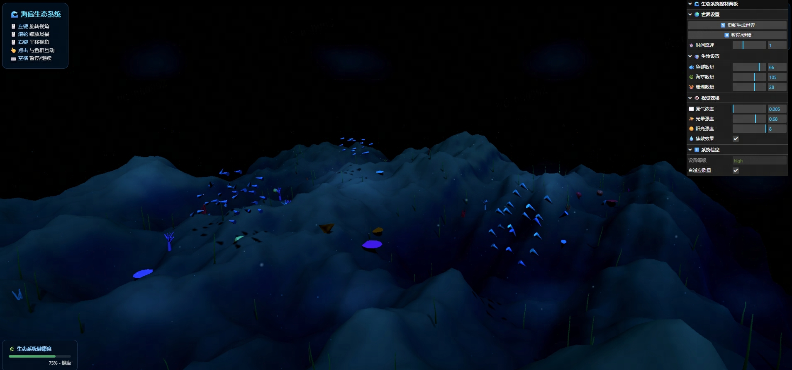

# 🌊 深海生态系统 3D 模拟器
[](https://CNSleepybear.github.io/sea-ecosystem-3d/)
[](https://threejs.org/)
[](LICENSE)

一个基于 WebGL 的高性能 3D 海底生态系统模拟器，使用 Three.js 构建，支持实时光照、粒子系统和基于 Boids 算法的智能鱼群 AI。




---

## ✨ 功能特性
### 🐠 智能生物系统
- **Boids 群体智能算法**：鱼群展示分离、对齐、聚合等自然群体行为
- **实时交互**：点击水面可惊吓鱼群，观察真实的逃避行为
- **空间哈希优化**：支持 100+ 条鱼的实时碰撞检测与避障
- **自适应质量**：根据设备性能自动调整画质等级（极高/高/中/低）

### 🌿 动态环境
- **GPU 顶点动画**：海草随水流自然摆动，完全 GPU 计算不占用 CPU
- **程序珊瑚生成**：5 种不同类型的珊瑚（脑纹、分支、管状、桌状、扇形）
- **动态地形**：基于 Simplex Noise 的多层程序化海底地形生成
- **实时光影**：体积光（上帝之光）、焦散效果、水下雾效

### 🎨 视觉效果
- **后处理管线**：泛光(Bloom)、水下扭曲、颜色校正
- **粒子系统**：浮游生物、气泡上升、海洋雪沉降
- **动态水面**：透明折射效果，模拟真实水面波动
- **PBR 材质**：基于物理的渲染，支持金属度和粗糙度

### ⚡ 性能优化
- **InstancedMesh 实例化**：支持大量鱼和植被的高效渲染
- **LOD 系统**：根据距离自动调整细节层次
- **自适应帧率**：当 FPS 低于 30 时自动降级画质保证流畅
- **对象池**：复用粒子对象，减少内存分配

---

## 🚀 在线体验
**🔗 [立即体验 3D 海底世界](https://CNSleepybear.github.io/sea-ecosystem-3d/)**

### 🕹️ 操作指南
| 操作 | 功能 |
| :---- | :---- |
| 🖱️ 左键拖拽 | 旋转视角 |
| 🖱️ 滚轮滑动 | 缩放场景 |
| 🖱️ 右键拖拽 | 平移视角 |
| 👆 点击水面 | 惊吓附近的鱼群 |
| ⌨️ 空格键 | 暂停 / 继续 |
| 👁️ 实时面板 | 查看 FPS、生物数量、系统健康度 |

---

## 🛠️ 技术栈
- **Three.js r162**：3D 渲染引擎
- **WebGL 2.0**：硬件加速图形渲染
- **Custom Shaders**：自定义 GLSL 着色器（焦散、体积光、GPU 动画）
- **Spatial Hash Grid**：空间哈希网格加速邻近查询
- **Object Pooling**：对象池优化内存管理
- **Adaptive Quality**：基于设备性能的自适应渲染质量

---

## 📦 本地运行
### 📋 环境要求
- 现代浏览器（Chrome 90+ / Firefox 88+ / Edge 90+ / Safari 14+）
- 支持 WebGL 2.0 的显卡
- 本地服务器（可选，用于开发调试）

### ⚡ 快速开始
```bash
# 1. 克隆仓库
git clone https://github.com/你的用户名/sea-ecosystem-3d.git
cd sea-ecosystem-3d

# 2. 启动本地服务器（任选其一）
# Python 3 内置服务器
python -m http.server 8000

# Node.js (需先安装http-server)
npx http-server -p 8000

# VS Code 快捷方式（安装Live Server插件）
# 右键 index.html → Open with Live Server

# 3. 浏览器访问
open http://localhost:8000
```

---

## 📁 项目结构
```
sea-ecosystem-3d/
├── index.html       # 主程序文件（整合 HTML/CSS/JS）
├── README.md        # 项目说明文档
├── LICENSE          # 开源许可证
└── docs/            # 文档与资源文件
    ├── demo.gif     # 项目动态演示图
    └── screenshot.png # 项目静态预览图
```

---

## 🎮 系统配置要求
| 画质等级 | FPS 目标 | 鱼群数量 | 开启特性 | 推荐设备 |
| :---: | :---: | :---: | :---- | :---- |
| 🟢 极高 | 60+ | 120 | 全部特效 | RTX 3060 / M1 Pro 及以上 |
| 🔵 高 | 60 | 80 | 泛光+焦散 | GTX 1060 / M1 及以上 |
| 🟡 中 | 45 | 50 | 基础后处理 | 主流集成显卡 / 中高端移动设备 |
| 🔴 低 | 30 | 25 | 基础渲染 | 入门级设备 / 低配移动设备 |

> ⚠️ 系统会自动检测设备性能并匹配最优画质等级，也可在实时控制面板中手动调整。

---

## 🖥️ 性能监控
界面右上角实时展示系统运行状态，包含以下核心指标：
- **FPS**：当前渲染帧率
- **帧时间**：单帧渲染耗时（ms）
- **鱼群数量**：当前场景活跃鱼群总数
- **绘制调用**：Draw Calls 渲染调用次数
- **质量等级**：当前生效的画质级别
- **生态健康度**：基于生物数量的生态系统评分

---

## 🧠 算法亮点
### Boids 群体行为算法
鱼群的智能行为基于经典 Boids 算法实现，核心行为包含5个维度，保证群体运动的自然性：
- **分离(Separation)**：个体间保持安全距离，避免拥挤碰撞
- **对齐(Alignment)**：跟随邻居的平均运动方向
- **聚合(Cohesion)**：向鱼群中心位置靠拢，保持群体形态
- **避障(Avoidance)**：通过空间哈希检测，自动避开地形/珊瑚障碍
- **边界约束**：限制鱼群在海底有效区域内活动，防止脱离场景

### GPU 顶点动画
海草的水流摆动效果通过**自定义 GLSL 顶点着色器**实现，全部计算在 GPU 完成，无 CPU 开销：
```glsl
// 顶点着色器中计算海草摆动偏移
float sway = sin(time * 1.5 + position.x) * strength;
pos.x += sway * bendFactor; // 基于顶点高度调整摆动幅度（顶部摆动更大）
```

---

## 📝 自定义配置
可在代码中搜索关键字 `params`，修改核心场景参数实现个性化定制，参数范围已做标注：
```javascript
// 场景核心配置参数
const params = {
    fishCount: 80,        // 初始鱼群数量 (推荐：10-120)
    seaweedCount: 150,    // 海草生成数量 (推荐：20-200)
    coralCount: 40,       // 珊瑚生成数量 (推荐：5-60)
    fogDensity: 0.012,    // 水下雾气浓度 (值越大视野越近)
    bloomStrength: 0.35,  // 泛光特效强度 (0-1)
    sunIntensity: 4,      // 阳光/体积光强度 (1-10)
    timeScale: 1          // 场景时间流速 (0.5-2，1为正常速度)
};
```

---

## 🤝 贡献指南
欢迎提交 **Issue** 反馈问题/提需求，或提交 **Pull Request** 参与开发！推荐贡献方向：
- 添加更多鱼类模型和骨骼动画
- 实现鱼群进食/繁殖/天敌的生态链行为
- 增加多人在线实时交互功能
- 优化移动端/低配设备的渲染性能
- 加入水下音效系统（环境音/鱼群游动音）
- 增加可交互的海底道具/场景元素

---

## 📄 许可证
本项目采用 **MIT 开源许可证** - 查看 [LICENSE](LICENSE) 文件获取详细信息 © 2026 Ranzhouhua

---

## 🙏 致谢
- **Three.js**：强大的轻量级 WebGL 3D 渲染库，为本项目提供核心渲染能力
- **GPU Gems**：水下光学效果（焦散、体积光）的实现参考
- **Craig Reynolds**：Boids 群体行为算法的原作者，奠定鱼群智能的基础
- **WebGL 社区**：提供了丰富的着色器和性能优化方案

---

🌟 如果这个项目对你有帮助，欢迎点个 **Star** 支持一下！你的支持是持续开发的动力～